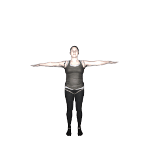

# PyTorch Neural Radiance Fields (NeRF) with SMPL embedding
### [Video](https://www.youtube.com/watch?v=8MCWE7R0xN8&ab_channel=HannesSt%C3%A4rk)
This repository is a PyTorch implementation of [NeRF](https://github.com/bmild/nerf) which can be trained on images of a scene to then render novel views. To enjoy the the vanilla NeRF just run the train file with `model_type=nerf`. Additionally, different model types are supported that embed an SMPL model of a human to control its pose in addition to the view point.
 

## Quickstart

- Create a 128x128 synthetic dataset of humans with different arm angles for the model type ``smpl_nerf``.
```bash
python create_dataset.py --dataset=smpl_nerf --save_dir=data --resolution=128 --start_angle=0 --end_angle=1 --number_steps=1 --human_number_steps=10 --multi_human_pose=1 --human_start_angle=0 --human_end_angle=60
```

- Install torchsearchsorted.
```bash
cd torchsearchsorted
pip install .
```

- Run the train file.
```bash
python train.py --experiment_name=SMPLNeRF --model_type=smpl_nerf --dataset_dir=data --batchsize=64 --batchsize_val=64 --num_epochs=100 --netdepth=8 --run_fine=1 --netdepth_fine=8
```

- Start tensorboard.
```bash
tensorboard --logdir=logs/summaries --port=6006
```

Navigate to `localhost:6006` in your browser and watch the model train.
## Requirements

- PyTorch >=1.4
- matplotlib
- numpy
- imageio
- configargparse
- torchsearchsorted
- smplx

Creating synthetic datasets requires

- pyrender
- trimesh


## Setting up the Baseline
- Clone Pix2Pix repo (TODO: install dependencies):
```bash
mkdir baseline/
cd baseline/
git clone https://github.com/junyanz/pytorch-CycleGAN-and-pix2pix.git
cd ..
```
- Create Dataset with (RGB, depth)-pairs
```bash
python create_dataset.py --dataset=pix2pix --save_dir=baseline/pytorch-CycleGAN-and-pix2pix/datasets/smpl --resolution=128 --start_angle=-90 --end_angle=90 --number_steps=10
```

- Train Pix2Pix on datasets (set name for experiment, set gpu_ids=-1 for CPU)
```bash
cd baseline/pytorch-CycleGAN-and-pix2pix/
python train.py --gpu_ids=0 --model=pix2pix --dataroot=datasets/smpl --name=SMPL_pix2pix --direction=BtoA --save_epoch_freq=50
```


## Model Types

- nerf: the vanilla NeRF
- image_wise_dynamic: the rays are not shuffeled between the image during processing so that the 
warp for every ray is only calculated once.

### NeRF is from the Paper:

Ben Mildenhall, Pratul P. Srinivasan, Matthew Tancik, Jonathan T. Barron, Ravi Ramamoorthi, & Ren Ng. (2020). NeRF: Representing Scenes as Neural Radiance Fields for View Synthesis.

